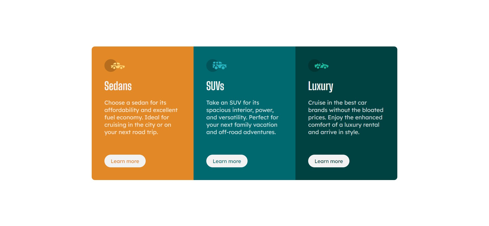

# Cards responsivos
 

Uma desafio front-end proposto pelo site front end mentor, criar um componente de cards responsivos com qualquer ferramenta.

[Acesse aqui o site](https://ericodesenvolvedor.github.io/cards-responsivos/)

### Ferramentas utilizadas

- HTML
- CSS

### Responsivo 

- Layout responsivo.

Criado com :heart: por 
  <a href="https://github.com/Ericodesenvolvedor">ericodesenvolvedor</a>

 
